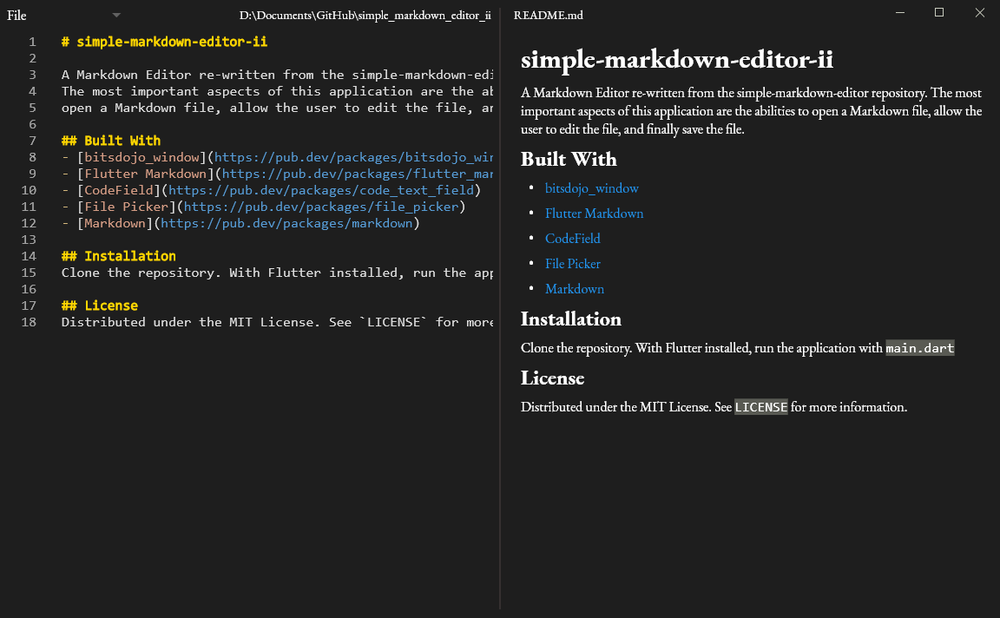

# simple-markdown-editor-ii

A Markdown Editor re-written from the simple-markdown-editor repository.
The most important aspects of this application are the abilities to 
open a Markdown file, allow the user to edit the file, and finally save the file.

## Built With
- [bitsdojo_window](https://pub.dev/packages/bitsdojo_window)
- [Flutter Markdown](https://pub.dev/packages/flutter_markdown)
- [CodeField](https://pub.dev/packages/code_text_field)
- [File Picker](https://pub.dev/packages/file_picker)
- [Markdown](https://pub.dev/packages/markdown)
- [url_launcher](https://pub.dev/packages/url_launcher)
- [pdf](https://pub.dev/packages/pdf)
- [html](https://pub.dev/packages/html)

## Installation 
Clone the repository. With Flutter installed, run the application with `main.dart`

## License
Distributed under the MIT License. See `LICENSE` for more information.